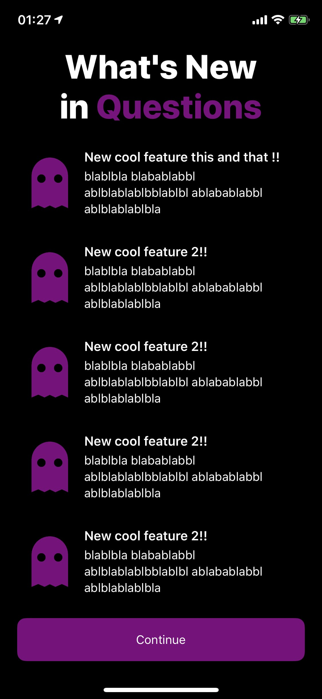

WhatsNew
---

🍎's "what's new" screen ported and made customizable and easy to use :)

### **Features**
- **Universal**. Compatible with iPad and iPhone, landscape and portrait.
- Adaptative.
  - Can use a popover in iPhone if just a few new features.
  - Easily tint all elements with `tintColor`
- Most elements found in 🍎's view:
  - Title
  - Subtitle
  - New features
  - "Learn More" button
  - Extra view

### Showcase

<p float="left">
  
  
  
</p>
<p float="left">
  
  
</p>


### Usage example

You can do this in your first view controller:

```swift
// automatically manages the view presentation for new versions
guard WhatsNewViewController.shouldPresentIfNewVersion else { return }

DispatchQueue.main.asyncAfter(deadline: .now() + .seconds(2)) {

	let attributedTitle = NSMutableAttributedString()
	attributedTitle.append(.init(string: "What's New in\n", attributes: [.font: UIFont.systemFont(ofSize: 30, weight: .heavy)]))
	attributedTitle.append(.init(string: "Questions", attributes: [
		.font: UIFont.systemFont(ofSize: 30, weight: .heavy),
		.foregroundColor: UIColor.red
	]))

	let newFeatures = [
		NewFeature(image: UIImage(named: "Ghost")!,
			  title: "1New cool feature this and that !!",
			  subtitle: "blablbla blabablabbl ablblablablbblablbl ablabablabbl ablblablablbla"),
		NewFeature(image: UIImage(named: "Ghost")!,
			  title: "2New cool feature 2!!",
			  subtitle: "blablbla blabablabbl ablblablablbblablbl ablabablabbl ablblablablbla"),
		NewFeature(image: UIImage(named: "Ghost")!,
			  title: "3New cool feature 2!!",
			  subtitle: "blablbla blabablabbl ablblablablbblablbl ablabablabbl ablblablablbla"),
		NewFeature(image: UIImage(named: "Ghost")!,
			  title: "4New cool feature 2!!",
			  subtitle: "blablbla blabablabbl ablblablablbblablbl ablabablabbl ablblablablbla"),
		NewFeature(image: UIImage(named: "Ghost")!,
			  title: "New cool feature 2!!",
			  subtitle: "blablbla blabablabbl ablblablablbblablbl ablabablabbl ablblablablbla"),
		NewFeature(image: UIImage(named: "Ghost")!,
			  title: "New cool feature 2!!",
			  subtitle: "blablbla blabablabbl ablblablablbblablbl ablabablabbl ablblablablbla"),
		NewFeature(image: UIImage(named: "Ghost")!,
			  title: "New cool feature 2!!",
			  subtitle: "blablbla blabablabbl ablblablablbblablbl ablabablabbl ablblablablbla")
	]

	let label = UILabel()
	label.text = "test"

	let whatsNewViewController = WhatsNewViewController.create(with: .init(
		title: .attributed(attributedTitle), // or: .default("What's new")
		subtitle: .default("Hi!!"),
		tintColor: .red,
		newFeatures: newFeatures,
		learnMoreLink: URL(string: "https://www.google.com")!,
		extraContentView: label,
		interfaceStyle: .light,
		sourceViewForPopoverStyleOnIPhoneIfFewElements: nil // viewController.view
	))

	//whatsNewViewController.delegate = self
	
	//viewController.present(whatsNewViewController, animated: true)
}

```
