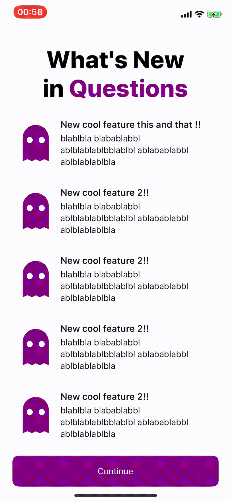
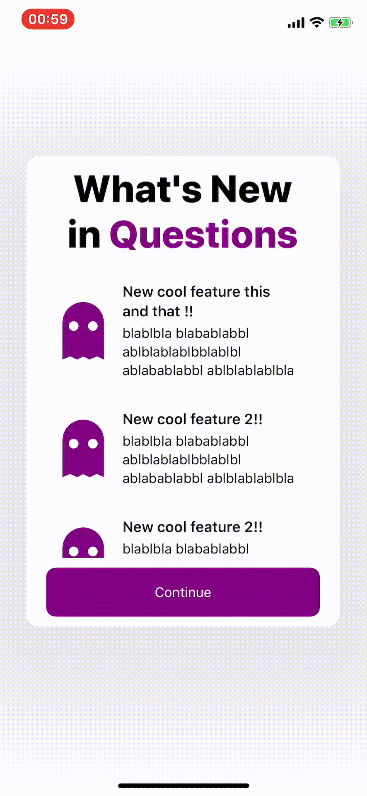
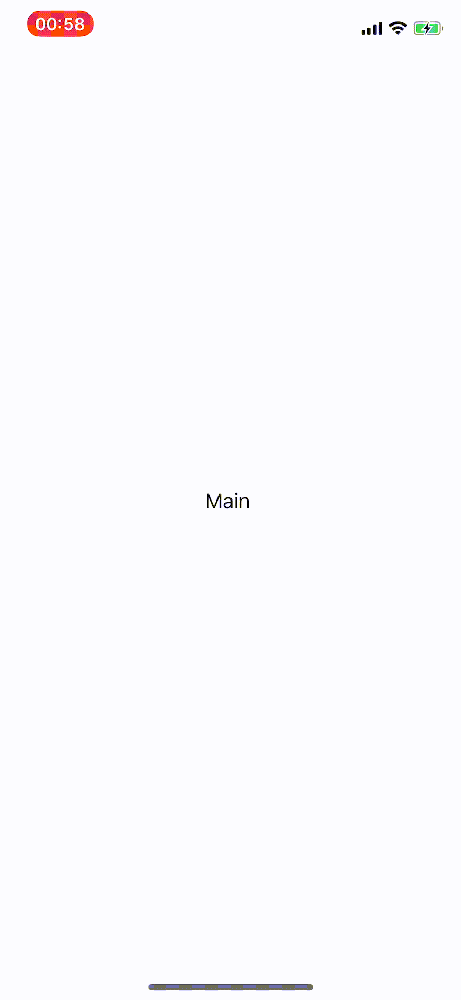
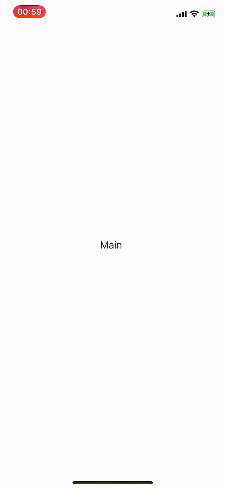
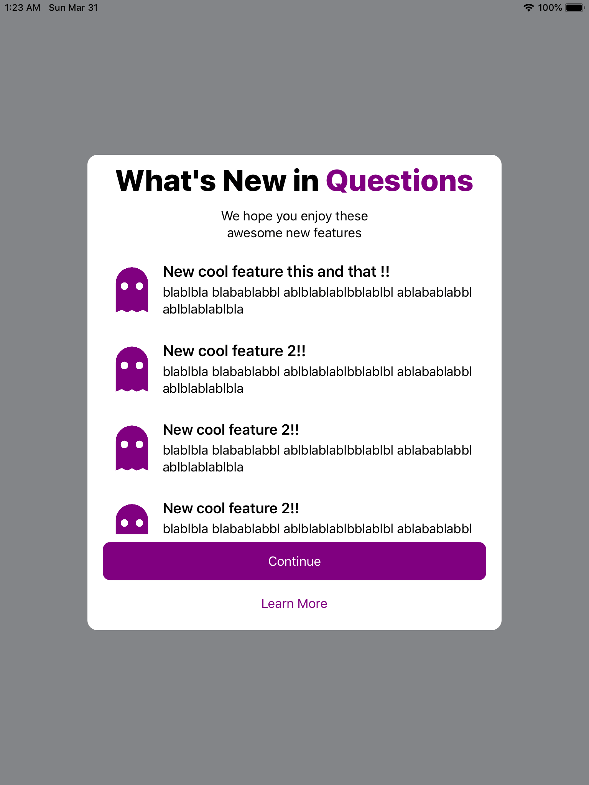

WhatsNew
---

🍎's "what's new" screen ported and made customizable and easy to use :)

### **Features**
- **Universal**. Compatible with iPad and iPhone, landscape and portrait.
- Adaptative.
  - Can use a popover in iPhone if just a few new features.
  - Easily tint all elements with `tintColor`
- Most elements found in 🍎's view:
  - Title
  - Subtitle
  - New features
  - "Learn More" button
  - Extra view

### Showcase

  
  

  
  

